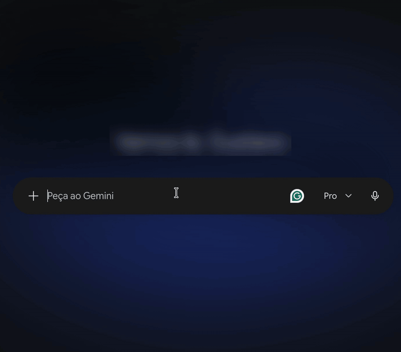

<p align="center">
  
</p>

# Kraa

[](https://github.com/gustafsilva/kraa/actions/workflows/ci.yml)
[](https://gustafsilva.github.io/kraa/)
[](https://www.npmjs.com/package/kraa)
[](LICENSE)
[](CONTRIBUTING.md)

**Selecione um texto em qualquer app, aperte um atalho e melhore com IA — rodando local e de
graça com o [Ollama](https://ollama.com).**

<p align="center">
  
</p>

## Por que usar

- **Funciona em qualquer app:** navegador, editor, chat, e-mail. Se dá para selecionar, dá para
  melhorar.
- **Local por padrão:** com o Ollama, o seu texto não sai da sua máquina.
- **Qualquer LLM compatível com a API da OpenAI:** Ollama, OpenAI, OpenRouter, LM Studio e
  outros.
- **macOS, Windows e Linux**, com fluxo 100% pelo teclado.

## Instalação

1. **Instale o [Ollama](https://ollama.com/download)** e baixe o modelo padrão:

   ```bash
   ollama pull llama3.2
   ```

2. **Instale e inicie o Kraa** (requer Node.js 18+):

   ```bash
   npm i -g kraa && kraa start
   ```

   O ícone do Kraa aparece na bandeja do sistema.

3. **Confira se está tudo certo:**

   ```bash
   kraa doctor
   ```

<details>
<summary>Sem Node.js, e observações por sistema</summary>

**Script de instalação**

```bash
curl -fsSL https://raw.githubusercontent.com/gustafsilva/kraa/main/scripts/install.sh | sh   # macOS / Linux
```

```powershell
irm https://raw.githubusercontent.com/gustafsilva/kraa/main/scripts/install.ps1 | iex        # Windows
```

**macOS:** conceda a permissão de **Acessibilidade** na primeira execução. Sem ela, só
"Copiar" funciona.

**Linux:** instale as dependências com
`sudo apt install libgtk-3-0 libwebkit2gtk-4.1-0 xdotool`. No Wayland só "Copiar" está
disponível; use `kraa trigger` como atalho do sistema.

</details>

Algo não funcionou? Veja a
[solução de problemas](https://gustafsilva.github.io/kraa/docs/ajuda/solucao-de-problemas/).

## Como usar

```
 seleciona texto   ──►   ⌘/Ctrl+Shift+Y   ──►   escolhe ação   ──►   resposta em stream
 em qualquer app         (captura a seleção)    ou instrução           │
                                                                       ├─► ⌘/Ctrl+Enter → Substituir
                                                                       └─► ⌘/Ctrl+Shift+C → Copiar
```

| Atalho | O que faz |
|---|---|
| `⌘⇧Y` (macOS) / `Ctrl+Shift+Y` | Abre o Kraa com o texto selecionado |
| `↑` `↓` `Enter` | Escolhe e executa uma ação (ou digite uma instrução livre) |
| `⌘/Ctrl+Enter` | Substitui a seleção original pelo resultado |
| `⌘/Ctrl+Shift+C` | Copia o resultado |
| `Esc` | Fecha e cancela |

## Documentação

| | |
|---|---|
| [Primeiros passos](https://gustafsilva.github.io/kraa/docs/uso/primeiros-passos/) | Da instalação à primeira melhoria |
| [Instalação](https://gustafsilva.github.io/kraa/docs/instalacao/npm/) | npm, scripts, Ollama, binários sem assinatura |
| [Configuração](https://gustafsilva.github.io/kraa/docs/configuracao/arquivo/) | `config.yaml`, providers, ações customizadas |
| [CLI](https://gustafsilva.github.io/kraa/docs/referencia/cli/) | `start`, `stop`, `trigger`, `doctor`… |
| [Plataformas](https://gustafsilva.github.io/kraa/docs/plataformas/macos/) | macOS, Windows, Linux (X11/Wayland) e privacidade |

## Contribua

Contribuições são bem-vindas, inclusive de quem está começando: documentação, testes em outros
sistemas, novas ações e providers. Comece pelas
[issues para iniciantes](https://github.com/gustafsilva/kraa/issues?q=is%3Aissue+is%3Aopen+label%3A%22good+first+issue%22),
leia o [guia de contribuição](CONTRIBUTING.md) e tire dúvidas nas
[Discussions](https://github.com/gustafsilva/kraa/discussions).

## Licença

[MIT](LICENSE)
